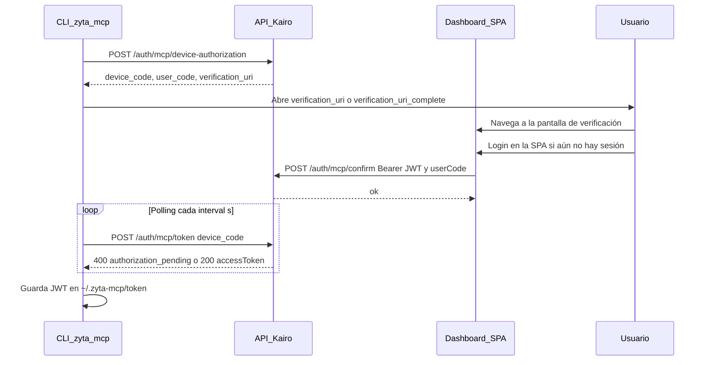

# Especificación backend: autenticación MCP / CLI (Device Authorization)

**Audiencia:** equipo que implementa el API Kairo / Zyta.  
**Objetivo:** permitir que usuarios autoricen **Cursor** y el **CLI `zyta-mcp`** sin introducir usuario/contraseña en el chat del asistente ni en el contexto del LLM.

**Referencia normativa:** [RFC 8628 — OAuth 2.0 Device Authorization Grant](https://datatracker.ietf.org/doc/html/rfc8628).

**Cliente de referencia:** repo `zyta-mcp` (`npm run login:device`), que asume los paths por defecto indicados abajo salvo configuración explícita.

**Implementación de referencia (API):** monorepo **Zyta-be** (`BE/Zyta-be`): `auth.controller.ts`, `mcp-device-auth.service.ts`, DTOs en `auth/dto/mcp-device.dto.ts`, tabla `mcp_device_codes`.

---

## 1. Resumen ejecutivo

| Qué hay que construir | Para qué |
|------------------------|----------|
| Endpoint que **crea** un flujo de dispositivo | El CLI obtiene `device_code`, `user_code` y URLs de verificación |
| Página o flujo web en **`verification_uri`** | El usuario inicia sesión (y MFA si aplica) **solo en vuestra aplicación** |
| Endpoint que **intercambia** `device_code` por JWT | El CLI hace polling hasta que el usuario terminó el login en el navegador |
| Persistencia temporal del `device_code` | Asociación segura entre “dispositivo esperando” y “sesión web aprobada” |

El JWT devuelto debe ser **el mismo tipo** que hoy devuelve `POST /auth/login` (`accessToken` Bearer para el resto del API), salvo decisión explícita de producto.

---

## 2. Por qué no alcanza con `POST /auth/login` en el CLI

| Enfoque | Problema de seguridad / producto |
|---------|----------------------------------|
| Credenciales en el chat de Cursor | Pasan por el modelo y por logs del proveedor de IA |
| `POST /auth/login` desde terminal | Aceptable operativamente; la contraseña no va al LLM, pero sigue siendo entrada sensible en la máquina |
| **Device flow (este documento)** | La contraseña y el MFA ocurren **solo** en vuestra web; el CLI solo recibe tokens |

---

## 3. Flujo (secuencia)

En la implementación **Zyta-be**, la confirmación explícita la hace el **dashboard** (usuario ya autenticado) con `POST /auth/mcp/confirm`, no el CLI.



---

## 4. Endpoints a implementar

Base: mismo host que el resto del API (ej. `https://api.ejemplo.com`). **HTTPS obligatorio en producción.**

### 4.1 `POST /auth/mcp/device-authorization`

Inicia un intento de autorización para un “dispositivo” (CLI / MCP).

**Request (JSON)**

```json
{
  "clientId": "opcional"
}
```

- `clientId`: opcional. Usadlo si más adelante registráis clientes (MCP de escritorio, CI, etc.). Si no aplica, podéis ignorar el campo.

**Response `200` (JSON)**

Convención: podéis responder en **camelCase** o **snake_case**; el cliente `zyta-mcp` acepta ambos.

| Campo | Obligatorio | Descripción |
|-------|-------------|-------------|
| `device_code` / `deviceCode` | Sí | Secreto opaco; **solo** lo usa el CLI en el endpoint de token. No mostrarlo al usuario final. |
| `user_code` / `userCode` | Sí | Código corto legible (ej. `ABCD-EFGH`) para pantallas y soporte. |
| `verification_uri` / `verificationUri` | Sí | URL absoluta HTTPS a vuestra pantalla de “Conectar Cursor / dispositivo”. |
| `verification_uri_complete` / `verificationUriComplete` | No | URL con el `user_code` ya incluido (query o path); mejora UX. |
| `expires_in` / `expiresIn` | Sí | Segundos hasta expiración del `device_code` (recomendado: 300–900). |
| `interval` | No | Segundos mínimos entre polls del cliente (recomendado: 5). Default en cliente si ausente: 5. |

**Errores**

- `400` / `403`: cuerpo JSON con al menos `{ "message": "string" }` (ej. cliente no permitido, feature flag apagado).

---

### 4.2 `POST /auth/mcp/token`

Intercambia el `device_code` por tokens una vez el usuario completó el login en la web.

**Request (JSON)** — forma alineada a OAuth 2.0:

```json
{
  "grant_type": "urn:ietf:params:oauth:grant-type:device_code",
  "device_code": "<valor devuelto en device-authorization>"
}
```

Opcional: aceptar también `grantType` / `deviceCode` en camelCase.

**Response `200` — éxito**

Mismo contrato que el login web actual, por ejemplo:

```json
{
  "accessToken": "<JWT>",
  "tokenType": "Bearer",
  "expiresIn": 3600
}
```

Alternativa estándar OAuth (el cliente también lo entiende):

```json
{
  "access_token": "<JWT>",
  "token_type": "Bearer",
  "expires_in": 3600
}
```

**Response `400` / `401` — pendiente o error OAuth**

Mientras el usuario **no** haya confirmado en el dashboard (`/auth/mcp/confirm`), el intercambio **no** devuelve `200`. Cuerpo JSON con:

```json
{
  "error": "authorization_pending"
}
```

**Nota (Zyta-be):** el endpoint `POST /auth/mcp/token` responde con **HTTP 400** y `{ "error": "<código>" }` para los estados OAuth de error/pending (no usa 401 para `authorization_pending`).

Otros valores de `error` (según RFC 8628 y la implementación de referencia):

| `error` | Significado | Comportamiento esperado del CLI |
|---------|-------------|--------------------------------|
| `authorization_pending` | Aún no se llamó a `confirm` o el usuario no aprobó | Seguir haciendo polling |
| `slow_down` | Polls demasiado frecuentes (Zyta-be limita según `interval`) | Aumentar intervalo entre intentos |
| `expired_token` | `device_code` inválido o vencido | Cortar; reiniciar flujo |
| `access_denied` | Flujo denegado (`/auth/mcp/deny`) o deshabilitado | Cortar con error claro |

---

### 4.3 `POST /auth/mcp/confirm`

Confirma la vinculación del **dispositivo** (CLI) a la cuenta del usuario que ya tiene sesión en el **dashboard**. **No** lo llama `zyta-mcp`; lo llama la **SPA** con el JWT del usuario.

**Autenticación:** `Authorization: Bearer <JWT>` (mismo token que el resto del API autenticado).

**Request (JSON):**

```json
{
  "userCode": "ABCD-EFGH"
}
```

- `userCode` (string, mín. 4 caracteres en Zyta-be): el código mostrado al usuario; puede incluir guion o enviarse sin separadores; el backend suele **normalizar** (mayúsculas, sin caracteres no alfanuméricos).

**Response `200`:**

```json
{ "ok": true }
```

**Errores:** `403` si el flujo está deshabilitado, el código no existe, está expirado o no está en estado pendiente.

**Efecto:** asocia el registro pendiente del `user_code` al `userId` del JWT y marca el dispositivo como **aprobado** para que `POST /auth/mcp/token` pueda emitir el JWT del dispositivo.

---

### 4.4 `POST /auth/mcp/deny` (opcional)

Misma autenticación y **mismo body** que `confirm` (`userCode`). Marca el intento como **denegado**; el CLI recibirá `access_denied` en el polling de `token`.

**Response `200`:** `{ "ok": true }`

---

## 5. Lógica de negocio sugerida

1. **`device-authorization`**  
   - Generar `device_code` criptográficamente fuerte (≥ 128 bits de entropía), TTL acotado.  
   - Generar `user_code` legible y **único** en la ventana de tiempo relevante.  
   - Persistir en almacén temporal (Redis, tabla SQL, etc.): `device_code_hash`, `expires_at`, estado `pending`, y campos vacíos para `user_id` / `session_id` hasta que la web confirme.

2. **Página `verification_uri`**  
   - Usuario autenticado en vuestra app (cookie / sesión / SSO).  
   - Pantalla explícita del tipo: “¿Conectar Cursor a tu cuenta?” con el `user_code` mostrado para evitar phishing.  
   - Al confirmar: la SPA llama a `POST /auth/mcp/confirm` con el JWT del usuario y el `userCode` (en Zyta-be: `McpDeviceConfirmDto`). Así se asocia el intent pendiente al `userId` correcto (no confiar solo en query params sin validación server-side).

3. **`confirm` (dashboard, con JWT)**  
   - `POST /auth/mcp/confirm` con `userCode` asocia el intent pendiente al usuario autenticado (Zyta-be: estado `APPROVED`).

4. **`deny` (opcional)**  
   - `POST /auth/mcp/deny` marca el intent como denegado; el polling devuelve `access_denied`.

5. **`token` (polling, público)**  
   - Si estado `pending` → `400` + `error: authorization_pending` (y en Zyta-be, `slow_down` si se respeta mal el intervalo).  
   - Si expiró → `error: expired_token`.  
   - Si aprobado → emitir JWT **una vez**, marcar fila como consumida, devolver `200` con `accessToken`.  
   - Rate-limit por IP (Zyta-be: throttling en controlador).

### 5.1 Persistencia y variables (Zyta-be)

| Elemento | Detalle |
|----------|---------|
| Tabla | `mcp_device_codes` (ver migración en el repo BE) |
| `device_code` | Se almacena **hash** (SHA-256), no el valor en claro |
| `verification_uri` | Base: `MCP_DEVICE_VERIFICATION_BASE_URL` o, si falta, `FRONTEND_URL`; path: `MCP_DEVICE_VERIFY_PATH` (default `/mcp-device`) |
| TTL | `MCP_DEVICE_CODE_TTL_SEC` (el servicio acota típicamente entre 300 y 900 s) |
| Intervalo de poll | `MCP_DEVICE_POLL_INTERVAL_SEC` (default 5 s); el BE puede responder `slow_down` |
| Activación | `MCP_DEVICE_AUTH_ENABLED` — si es `false`, el flujo queda deshabilitado |

Listado comentado en `BE/Zyta-be/.env.example`.

---

## 6. Seguridad (checklist)

- [ ] Solo HTTPS en producción; HSTS donde corresponda.  
- [ ] `device_code` de un solo uso y con expiración estricta.  
- [ ] No loguear JWT ni `device_code` en texto plano en logs de aplicación.  
- [ ] Rate limiting en ambos endpoints.  
- [ ] Auditoría: eventos de inicio, éxito, denegación, expiración (sin datos sensibles).  
- [ ] Alineación con política de vida del JWT (expiración, refresh, revocación) igual que el resto del producto.

---

## 7. Criterios de aceptación (QA)

1. `POST /auth/mcp/device-authorization` devuelve 200 con todos los campos obligatorios y URLs HTTPS válidas.  
2. Con sesión en el dashboard, `POST /auth/mcp/confirm` con el `userCode` mostrado devuelve `{ ok: true }` y el polling deja de devolver solo `authorization_pending`.  
3. Sin `confirm`, `POST /auth/mcp/token` sigue devolviendo `authorization_pending` (hasta TTL o `deny`).  
4. Tras `confirm`, el primer `token` exitoso devuelve un JWT válido para un endpoint protegido (ej. `GET /judicial/portals/status`).  
5. Un segundo uso del mismo `device_code` en `token` debe fallar (código ya consumido).  
6. Tras `expires_in`, el `device_code` debe rechazarse con `expired_token`.  
7. (Opcional) `POST /auth/mcp/deny` hace que el polling devuelva `access_denied`.

---

## 8. Prueba con el cliente oficial

En el repo **zyta-mcp** (cuando el BE esté desplegado):

```bash
npm install && npm run build
export KAIRO_API_BASE_URL="https://vuestra-api"
npm run login:device
```

Debe abrirse el navegador en `verification_uri`. El usuario debe **iniciar sesión en el dashboard** (si hace falta) y la vista en `MCP_DEVICE_VERIFY_PATH` debe llamar a **`POST /auth/mcp/confirm`** con el `userCode`; recién entonces el polling del CLI obtiene el JWT y guarda el token.

Paths personalizados (si no usáis los defaults): documentados en el README de `zyta-mcp` (`KAIRO_MCP_DEVICE_AUTH_PATH`, `KAIRO_MCP_DEVICE_TOKEN_PATH`).

---

## 9. Compatibilidad con `POST /auth/login`

No es obligatorio deprecar el login por email/contraseña para el dashboard. El device flow es **adicional** para integraciones tipo MCP/CLI. Reutilizad la misma emisión de JWT y mismas claims que ya usan el front y el API.

---

## 10. Contacto / dudas

Decisiones abiertas típicas: duración del JWT, si el `user_code` debe coincidir manualmente en UI, soporte multi-tenant, y si se expone un `client_id` fijo para el binario oficial de Zyta.

---

*Documento alineado al cliente `zyta-mcp` y a la implementación de referencia en **Zyta-be** (NestJS).*
